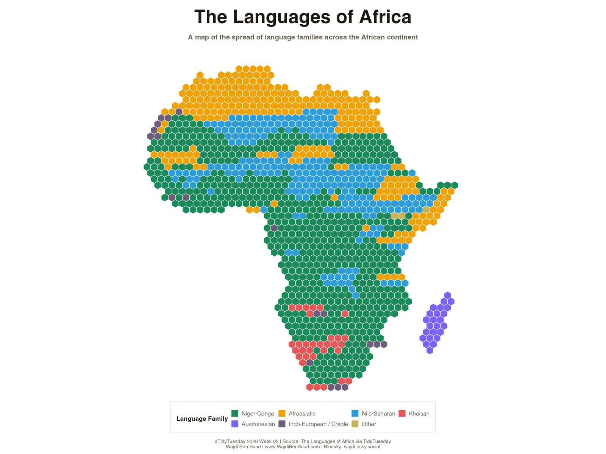

# TidyTuesday 2026-01-13: The Languages of Africa

## About

This week's TidyTuesday dataset looks at languages of Africa, including each language's family, estimated native speakers, and the countries where it is spoken.

For this chart, I turned the African country map into a hex tessellation. Each hex belongs to a real country footprint, and the colors inside each country show how the listed languages split across language families.

The final design uses a warm paper background, a light field of script-like letterforms, and side borders adapted from an African-pattern vector asset.

Data source:

- [TidyTuesday 2026-01-13](https://github.com/rfordatascience/tidytuesday/blob/main/data/2026/2026-01-13/readme.md)

## Quick Read

- Niger-Congo dominates the largest share of countries south of the Sahara.
- Afroasiatic forms a strong northern and Horn of Africa band.
- Nilo-Saharan appears as a visible central/eastern layer rather than a continent-wide pattern.
- Smaller families and colonial/creole language groupings appear as localized pockets.
- The hex layout abstracts geography, but it keeps the continental shape visible while making multi-family countries easier to compare.

## The making of the chart: step by step
I tried to include the main steps I took to build this chart, but I intentionally omitted many minor steps and decisions to keep the process digestible. The GIF below shows the chart being built from start to finish, with a few pauses to highlight key steps.

## Notes

The map uses country polygons from the R `maps` package and clips a regular hex grid to those polygons. Some country labels are manually positioned as outside callouts to keep the dense central and southern parts of the map readable.

Pattern attribution:

- Side border pattern adapted from [Vecteezy: Abstract Juneteenth Freedom Day Background with Colorful African Pattern](https://www.vecteezy.com/vector-art/21574927-abstract-juneteenth-freedom-day-background-with-colorful-african-pattern).
