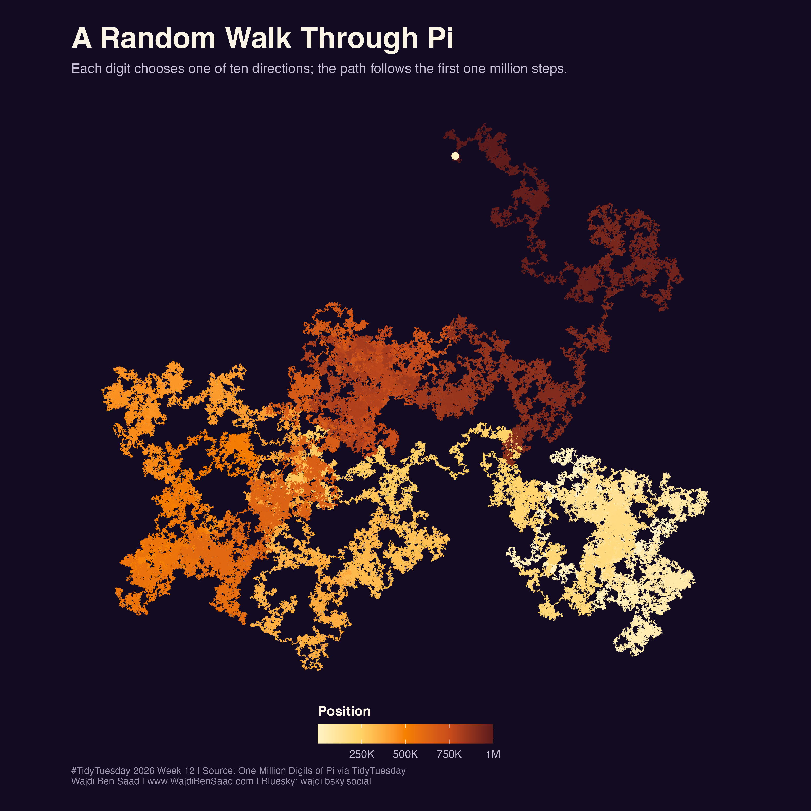

# TidyTuesday 2026-03-24: One Million Digits of Pi

## About

This week uses the first one million decimal digits of pi, with one row per digit position.

The downloaded file has `1,000,001` rows because it includes the leading `3` before the decimal expansion.

I kept two visual approaches:

- a **digit spiral** using the first 3,141 positions
- a **random walk** using the first one million decimal positions

## Reading The Chart

The spiral view writes out the first 3,141 digits directly. Prime digits, `2`, `3`, `5`, and `7`, are set larger to make some radial ridges easier to see while keeping the decimal sequence readable.

In the random walk, each digit chooses one of ten directions. The path starts in light cream and moves toward darker red as the digit position increases. What looks like a coastline or branching terrain is produced only by the order of pi's digits and a fixed direction rule.

Data source:

- [TidyTuesday 2026-03-24](https://github.com/rfordatascience/tidytuesday/blob/main/data/2026/2026-03-24/readme.md)
