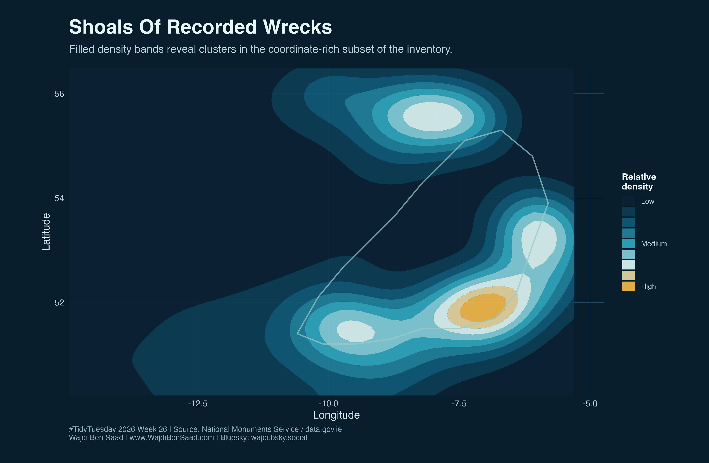
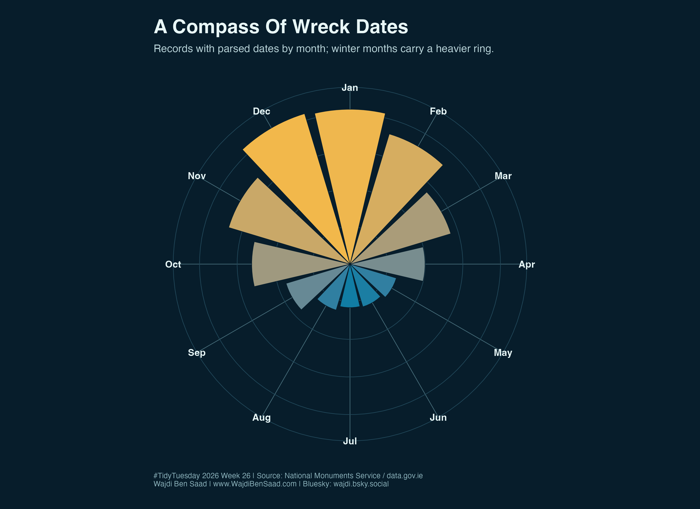
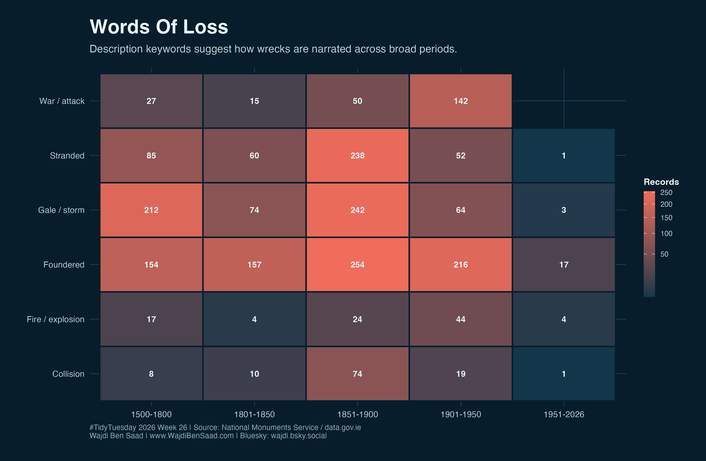
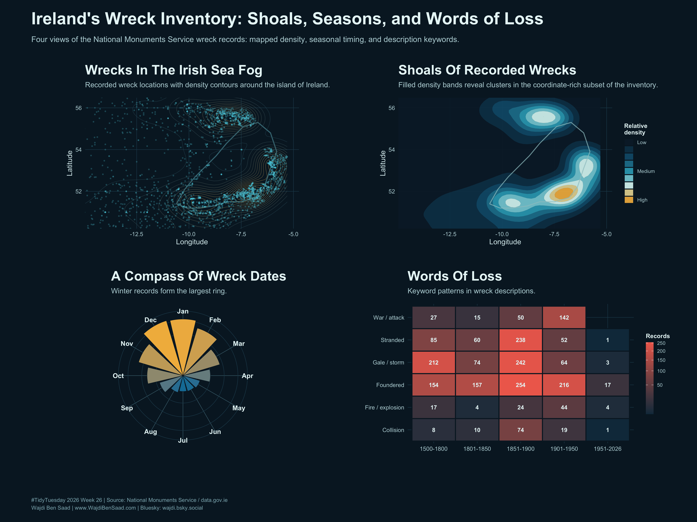

# TidyTuesday 2026-06-30: Wreck Inventory of Ireland

Nautical-themed visualizations of the National Monuments Service Wreck Inventory of Ireland. The dataset catalogs known and potential wreck sites around Ireland, with fields such as wreck name, date/year, classification, place of loss, description, coordinates, and coordinate source.

Data sources:

- [TidyTuesday 2026-06-30](https://github.com/rfordatascience/tidytuesday/blob/main/data/2026/2026-06-30/readme.md)
- [data.gov.ie: Wreck Inventory of Ireland](https://data.gov.ie/dataset/national-monuments-service-wreck-inventory-of-ireland)
- [Wreck Viewer](https://www.archaeology.ie/advice-and-support/locate-a-monument-or-wreck/wreck-viewer/)

Local note: the raw CSV is stored in `2026/data/`, which is ignored by git.

## Final Charts

### 1. Wreck Density Nautical Chart

Coordinate-bearing records plotted as a dark nautical chart with density contours. The chart highlights visible clusters near the east, south, and north coasts, while also showing that many coordinates sit farther offshore.

### 2. Filled Density Shoals

A more abstract density map. The filled contours make the main wreck "shoals" easier to see than individual points.

### 3. Monthly Compass Rose

Parsed wreck dates summarized by month. Winter months form the heaviest ring, especially December and January.

### 4. Words Of Loss

Keyword patterns in the description field, grouped into broad loss narratives such as storm, stranding, collision, fire, war, and foundering. The x-axis uses broad year ranges rather than raw interval labels.

## Poster

The poster combines the spatial views, seasonal compass, and keyword heatmap into one final composition.

