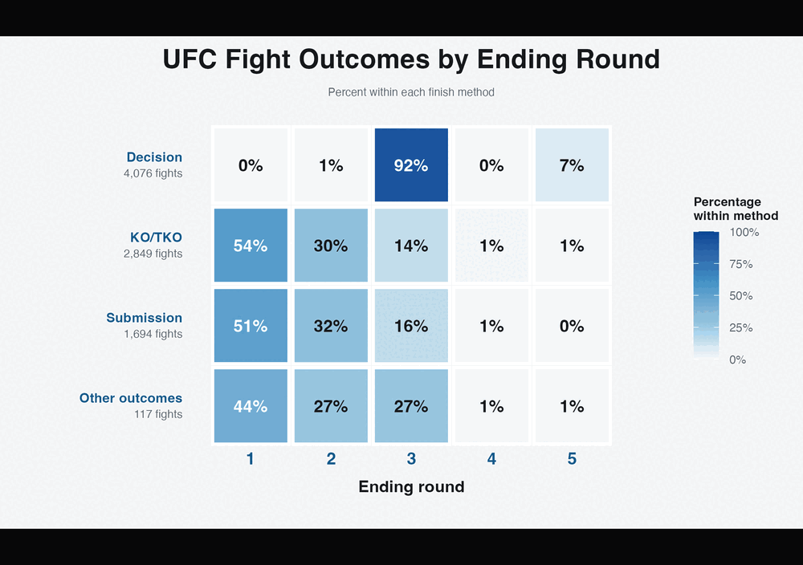

# TidyTuesday 2026-07-07: UFC Fights

## About

This week's TidyTuesday dataset contains UFC fight records, including event dates, fight outcomes, finish methods, and ending rounds.

The final chart asks a simple question: **when does each type of UFC outcome occur?** Fight results are grouped into decisions, knockouts or technical knockouts, submissions, and other outcomes. Each row shows the percentage of that method ending in rounds one through five.

Data source:

- [TidyTuesday 2026-07-07: UFC Fights](https://github.com/rfordatascience/tidytuesday/blob/main/data/2026/2026-07-07/readme.md)

The raw CSV is downloaded to `2026/data/` when needed. That directory is ignored by git.

## Reading The Chart

- Decisions overwhelmingly follow round three, reflecting the standard length of most UFC bouts.
- Knockouts and technical knockouts are front-loaded: more than half occur in round one.
- Submissions follow a similar early-round pattern, with very few occurring in rounds four or five.
- Percentages are calculated within each finish method, so every row totals 100%.

Whole-number labels use a largest-remainder rounding method. This preserves the row totals while the cell colors continue to use the exact, unrounded percentages.

## Design

Regular octagons reference the UFC cage. A restrained mesh, double outline, and shadow add depth without obscuring the values. The color scale moves from graphite through burgundy to UFC red, with low percentages visually deemphasized.

The title uses Sternbach Italic, distributed under the SIL Open Font License. The clean UFC wordmark is derived from the official vector mark used on [UFC.com](https://www.ufc.com/).

## The making of the chart: step by step

The animation shows the chart developing from a conventional blue heatmap into octagonal cells, a UFC-red palette, the dark theme, cage mesh, final title treatment, logo placement, and double contour.

