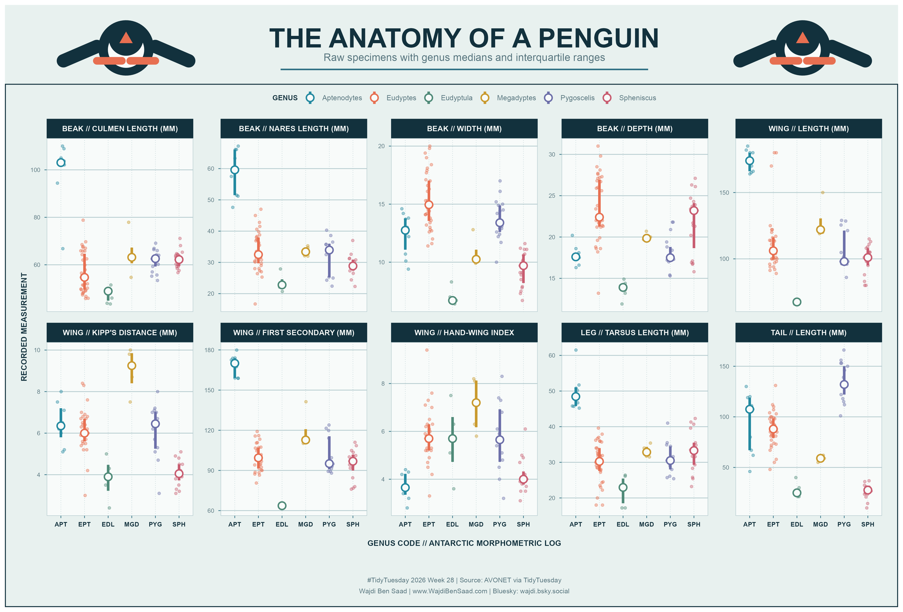

# TidyTuesday 2026-07-14: Many Penguins

## About

This week's TidyTuesday dataset contains morphometric measurements for 93 penguins representing 18 species across 6 genera.

The chart compares all ten recorded anatomical traits across the six genera. Raw specimens appear behind genus medians and interquartile ranges, allowing both individual variation and broader group differences to remain visible.

Data source:

- [TidyTuesday 2026-07-14: Many Penguins](https://github.com/rfordatascience/tidytuesday/blob/main/data/2026/2026-07-14/readme.md)

The raw CSV is downloaded to `2026/data/` when needed. That directory is ignored by git.

## Reading The Chart

- Each panel shows one anatomical measurement using its original scale.
- Small points are individual penguins.
- Large white-centered points mark genus medians.
- Vertical lines show the interquartile range for each genus.
- Missing observations are omitted only from the affected measurement panel.

Together, the panels show how body proportions vary across genera rather than reducing penguin anatomy to a single measurement.

## Design

The visualization uses a light Antarctic research-chart aesthetic: ice-paper panels, navy chart ink, sea-blue grid lines, signal-orange details, and custom penguin pictograms. Decorative elements stay in the header so the scientific small multiples remain central.

The chart was created in R with `ggplot2`, `dplyr`, `tidyr`, and `patchwork`.
