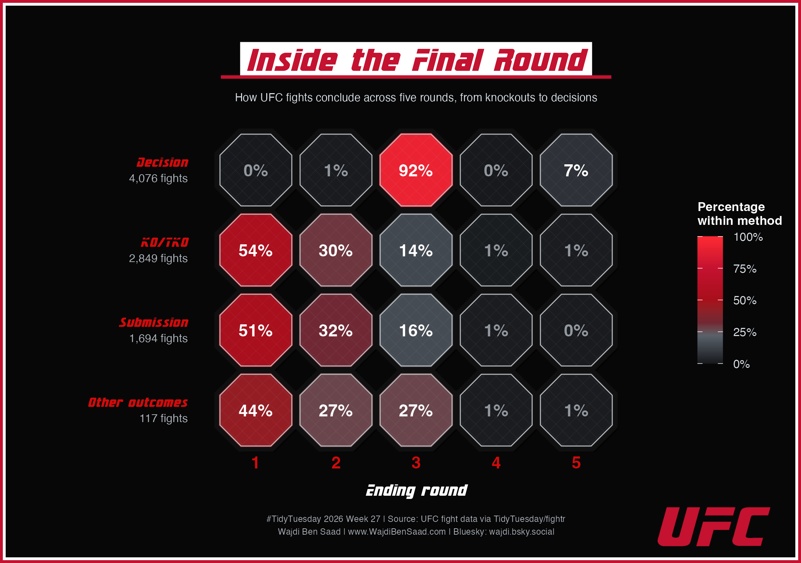
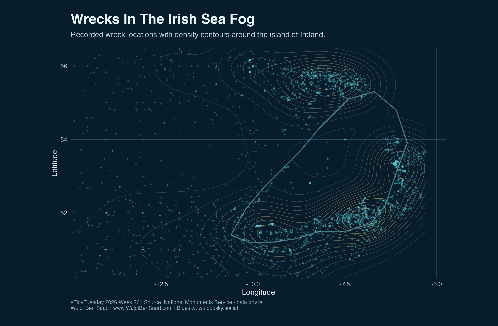
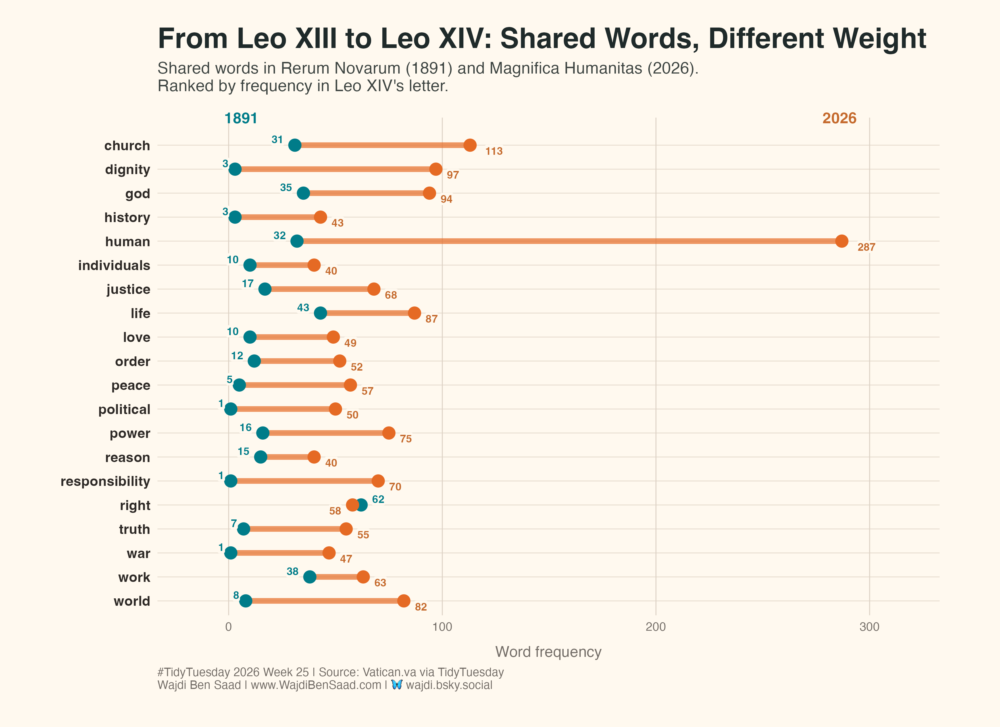
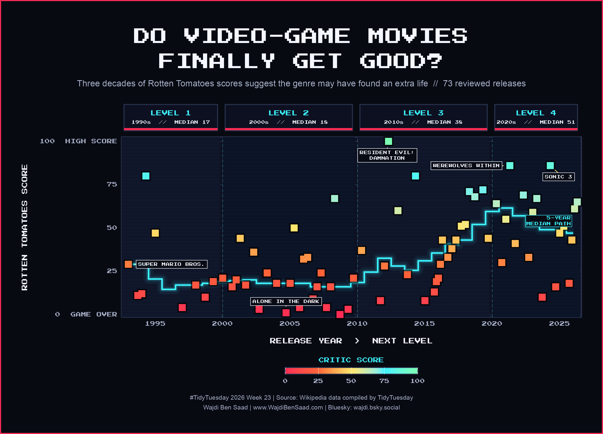
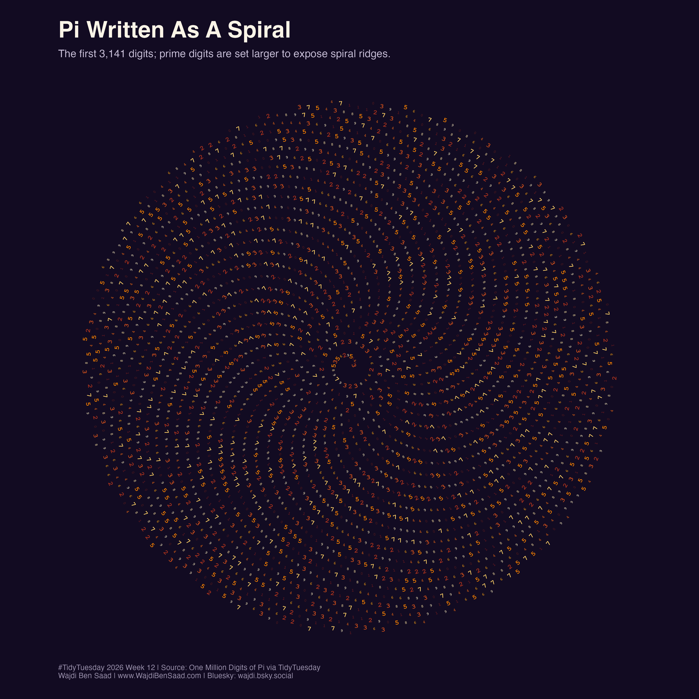
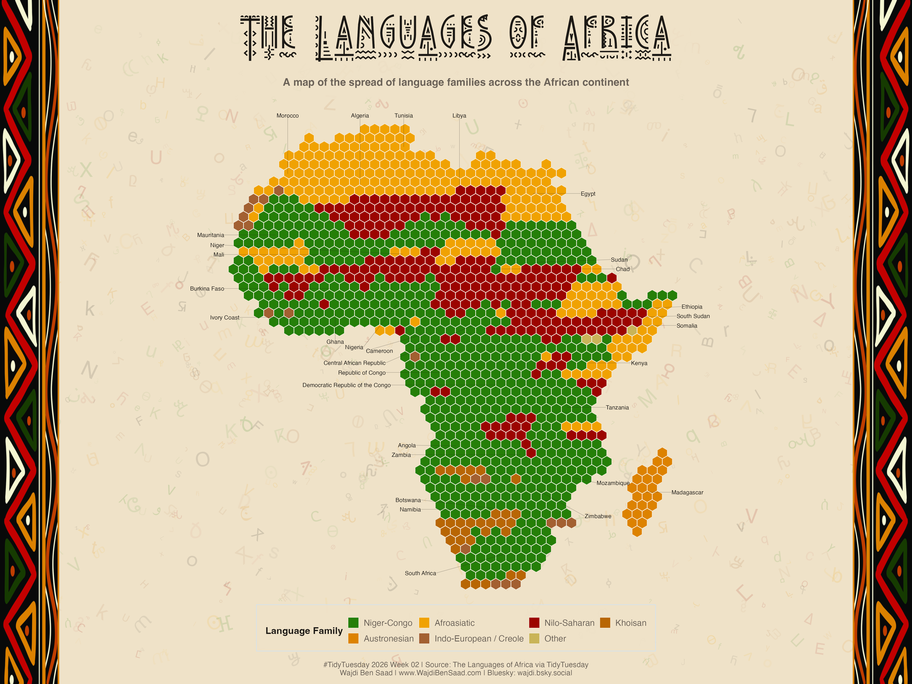

# TidyTuesday

My contributions to the [#TidyTuesday](https://github.com/rfordatascience/tidytuesday) challenge: weekly R visualizations built with `ggplot2`, `dplyr`, and the wider tidyverse ecosystem.

Each completed week includes:

- the R code used to create the final plot
- the exported PNG
- a short README with the data source and chart notes


## Links

- Website: [www.WajdiBenSaad.com](https://www.WajdiBenSaad.com)
- Bluesky: [wajdi.bsky.social](https://bsky.app/profile/wajdi.bsky.social)

## Contributions

### 2026

#### [2026-07-07: UFC Fights](2026/2026-07-07/)

An octagon heatmap showing when UFC fights end across five rounds, with percentages calculated within each finish method.

[](2026/2026-07-07/)

#### [2026-06-30: Wreck Inventory of Ireland](2026/2026-06-30/)

Nautical-themed visualizations of Ireland's recorded wreck inventory: location density, seasonal patterns, and description keywords.

[](2026/2026-06-30/)

#### [2026-06-23: Papal Encyclicals](2026/23-06-2026/)

Shared vocabulary in two papal encyclicals by two popes named Leo: **Rerum Novarum** by Leo XIII in 1891 and **Magnifica Humanitas** by Leo XIV in 2026.

[](2026/23-06-2026/)

#### [2026-06-09: Films Based on Video Games](2026/2026-06-09/)

An arcade-inspired timeline asking whether video-game movies have improved, using Rotten Tomatoes scores and a rolling five-year median.

[](2026/2026-06-09/)

#### [2026-03-24: One Million Digits of Pi](2026/2026-03-24/)

Two visual readings of pi's decimal expansion: the first 3,141 digits written as a spiral and the first one million digits traced as a random walk.

[](2026/2026-03-24/)

#### [2026-01-13: The Languages of Africa](2026/2026-01-13/)

A hex-tessellated map of Africa showing how listed languages split across language families by country.

[](2026/2026-01-13/)

## Repository Structure

```text
YYYY/
  YYYY-MM-DD/
    README.md
    chart_script.R
    final_plot.png
```

Exploration files and local data are ignored by git.
